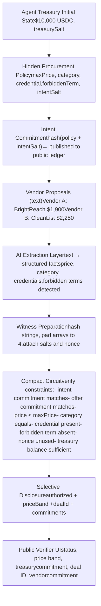

# SilentIntent Master Execution Document

* SILENTINTENT — MASTER EXECUTION DOCUMENT
        * How to use this document
* PART 1: PROJECT OVERVIEW
        * 1.1 What SilentIntent is, in one sentence
        * 1.2 The 30-second pitch
        * 1.3 The problem
        * 1.4 The solution
        * 1.5 The demo scenario
        * 1.6 Why this can win Top 2
        * 1.7 Why we picked SilentIntent over alternatives
        * 1.8 The single bet
* PART 2: TRACK FRAMING
        * 2.1 Why DeFi primary
        * 2.2 Why AI secondary, not primary
        * 2.3 Three additions that strengthen DeFi framing
        * 2.4 What we never say
* PART 3: MIDNIGHT AND COMPACT TECHNICAL PRIMER
        * 3.1 What Midnight is
        * 3.2 The three-component model
        * 3.3 Public ledger state for SilentIntent
        * 3.4 Private witnesses
        * 3.5 Circuits
        * 3.6 Commitments
        * 3.7 Selective disclosure
        * 3.8 Set membership and non-membership
        * 3.9 Nonce and replay prevention
        * 3.10 What Midnight cannot do
        * 3.11 The one rule everyone memorizes
* PART 4: SYSTEM ARCHITECTURE
        * 4.1 End-to-end data flow
        * 4.2 Type definitions
        * 4.3 File and folder structure
        * 4.4 State locations
        * 4.5 Demo mode fallback paths
        * 4.6 Security boundaries
* PART 5: TEAM ROLES
        * 5.1 Compact Owner
        * 5.2 Frontend Owner
        * 5.3 AI/Data Owner
        * 5.4 Integration Owner
        * 5.5 PM/Demo Owner (Vishnu — locked)
* PART 6: HOUR-BY-HOUR EXECUTION SCHEDULE
        * 6.1 Hour 0-4 (Friday 12 PM ET — 4 PM ET)
        * 6.2 Hour 4-8 (Friday 4 PM ET — 8 PM ET)
        * 6.3 Hour 8-12 (Friday 8 PM ET — Saturday 12 AM ET)
        * 6.4 Hour 12-16 (Saturday 12 AM — 4 AM ET)
        * 6.5 Hour 16-20 (Saturday 4 AM — 8 AM ET)
        * 6.6 Hour 20-24 (Saturday 8 AM — 12 PM ET)

* 6.7 Hour 24-28 (Saturday 12 PM — 4 PM ET)
* 6.8 Hour 28-32 (Saturday 4 PM — 8 PM ET)
* 6.9 Hour 32-36 (Saturday 8 PM — Sunday 12 AM ET)
* 6.10 Hour 36-40 (Sunday 12 AM — 4 AM ET)
* 6.11 Hour 40-46 (Sunday 4 AM — 10 AM ET)
* 6.12 Hour 46-49 (Sunday 10 AM — 1 PM ET)
* PART 7: VENDOR PROPOSAL COPY (LOCKED)
    * 7.1 Vendor A — BrightReach Data ($1,900)
    * 7.2 Vendor B — CleanList Pro ($2,250)
    * 7.3 Why this specific contrast works
    * 7.4 Hidden procurement policy (for the demo)
    * 7.5 Extracted offer facts (cached fallback)
* PART 8: THE README (DRAFT FOR FINAL EDITING BY PM)
    * 8.1 Title and pitch
    * 8.2 What it does
    * 8.3 The treasury debit
    * 8.4 What stays private
    * 8.5 What gets disclosed
    * 8.6 Why Midnight
    * 8.7 How we use AI
    * 8.8 How the proof works
    * 8.9 Setup
    * 8.10 Demo mode vs live mode
    * 8.11 Limitations (the three honest weaknesses)
    * 8.12 Roadmap
    * 8.13 Tech stack
    * 8.14 Team
    * 8.15 License
* PART 9: DEVPOST SUBMISSION COPY (DRAFT)
* PART 10: 2-MINUTE DEMO SCRIPT
* PART 11: COMPETITOR-INTELLIGENCE PANEL — VISUAL SPEC
    * 11.1 Layout
    * 11.2 Locked copy
    * 11.3 The wrong copy (do not use)
    * 11.4 Microcopy
    * 11.5 Implementation notes
* PART 12: JUDGE Q&A
    * Q1: What does the proof actually prove?
    * Q2: Is this really DeFi or is it AI wearing DeFi clothes?
    * Q3: Could you do this with a normal backend?
    * Q4: Why Midnight specifically, not Aztec or Aleo?
    * Q5: What stops the AI from lying about extracted facts?
    * Q6: Where does payment actually happen?
    * Q7: Who is the first paying customer in 2026?
    * Q8: How is this $100M, not a feature?
    * Q9: What’s the worst-case attack on this system?
    * Q10: Live or cached — what’s real in your demo?
    * Q11: What did you cut from v1 and why?
    * Q12: If I gave you 6 months, what does v2 look like?
* PART 13: COMMUNICATION AND OPERATING RULES
    * 13.1 Sync schedule (voice calls)

* 13.2 Async status updates
* 13.3 Decision authority
* 13.4 Ghost protocol
* 13.5 Scope-cut ladder (canonical order)
* 13.6 Tone rule
* 13.7 Privacy rule
* PART 14: RISK REGISTER
* PART 15: LIVE DEMO FAILURE RECOVERY
    * 15.1 Pre-demo checklist (30 minutes before any live judging)
    * 15.2 Eight failure modes
    * 15.3 Calm voice rule
* PART 16: SUBMISSION CHECKLIST
    * 16.1 Repo
    * 16.2 Devpost
    * 16.3 Video
    * 16.4 Final verification
* PART 17: STRETCH AMBITIONS PER ROLE
    * 17.1 Compact
    * 17.2 Frontend
    * 17.3 AI/Data
    * 17.4 Integration
    * 17.5 PM/Demo
* PART 18: BUILD CLUB POSITIONING
    * 18.1 Founder narrative arc
    * 18.2 Investor one-pager content (PM stretch goal)
    * 18.3 Post-hackathon outreach (whether we win or not)
* PART 19: WHY WE WIN — THE 3-SENTENCE PITCH
* PART 20: RULES FOR THIS DOCUMENT AND ALL TEAM COMMUNICATION
* APPENDIX A: LLM PROMPT FOR TEAMMATES

# SILENTINTENT — MASTER EXECUTION DOCUMENT

---

**Project:** SilentIntent **Hackathon:** Midnight Hackathon (MLH), May 15–17, 2026 **Track:** DeFi primary, AI secondary **Repo:** github.com/vishnumahesha/midnight-hackathon **Submission deadline:** Sunday May 17, 11:45 AM EDT **Status:** Idea locked. Execution starts now. **Document version:** Master v1.0

---

## How to use this document

Read it once front to back before claiming a role. Paste it into your LLM (Claude, ChatGPT, Gemini) when you need to think through a decision. Your LLM now has full context: the locked scope, the role definitions, the technical primer, the schedule, the demo, the risks, the recovery paths, and the submission checklist.

When in doubt during the build, search this document before asking the team. If the answer isn’t here, ask in Discord and we’ll update the document.

This is the single source of truth. If something in Discord contradicts this document, this document wins until updated.

# PART 1: PROJECT OVERVIEW

## 1.1 What SilentIntent is, in one sentence

SilentIntent is a confidential smart contract for AI-agent procurement spend: it proves an agent’s purchase decision satisfies the company’s hidden procurement policy without exposing the policy, the agent’s budget, or the vendor’s full terms.

## 1.2 The 30-second pitch

AI agents are starting to buy APIs, data, cloud services, software, and business services on behalf of companies. Every purchase requires a hidden procurement strategy: max budget, required credentials, deal-breakers, vendor priorities. If that strategy leaks, vendors exploit it by pricing near the cap, mirroring priorities, and burying risky terms in legalese.

SilentIntent uses Midnight to prove a vendor offer satisfies the company’s hidden procurement policy. The public sees only the authorization result, a price band, and cryptographic commitments. The policy stays private. The agent’s treasury commitment is private. The vendor’s full terms stay private.

## 1.3 The problem

Public blockchains expose every transaction. Agent commerce is moving on-chain. Once a company gives an AI agent a budget and a wallet, every public transaction reveals the agent’s procurement strategy:

* Vendors learn the company’s price ceiling and reverse-engineer pricing
* Competitors learn which vendors a company uses
* Markets learn the company’s purchasing patterns
* Adversaries learn deal-breakers and can craft attacks

This problem doesn’t exist yet at scale because agent commerce barely exists yet at scale. But the infrastructure must exist before the deals do, not after. SilentIntent is privacy-native procurement infrastructure for agent commerce.

## 1.4 The solution

A confidential smart contract running on Midnight that:

1. Accepts a private procurement policy (budget, required credentials, forbidden terms, category) as private witnesses
2. Accepts vendor offer facts (extracted from natural-language proposals by an AI layer) as private witnesses
3. Verifies the offer satisfies the policy using zero-knowledge constraints
4. Selectively discloses only the authorization result, a price band, the deal ID, and cryptographic commitments
5. Maintains a mock agent treasury balance that visibly debits on authorization, showing this is a financial gating layer, not abstract proof theater

The proof is the financial primitive. Payment rails (x402, Stripe Agentic Commerce, AWS AgentCore Payments, direct Midnight transfers) are downstream consumers of this proof.

## 1.5 The demo scenario

A company’s AI procurement agent needs to buy dental lead data. The company has given the agent a $10,000 USDC treasury and a hidden procurement policy.

**Hidden policy:** - Max budget per purchase: $2,500 - Required category: lead_data - Required credential: freshness_verified - Forbidden term: campaign_metadata_reuse - Required delivery: within 72 hours

**Vendor A — BrightReach Data ($1,900):**

> *BrightReach Data provides high-volume dental practice lead datasets refreshed weekly from commercial web sources and verified partner networks. Our standard package includes 10,000 clinic contacts, optional CRM enrichment, and delivery within 48 hours. To improve accuracy across future campaigns, BrightReach may use anonymized campaign metadata, segment performance, and buyer interaction signals for partner enrichment, audience modeling, and benchmark optimization across similar customers. Price: $1,900.*

Surface-best: cheaper, faster (48 hours vs 72), higher volume. Buried in mid-paragraph corporate legalese: campaign metadata reuse for partner enrichment. This is the hidden violation.

**Vendor B — CleanList Pro ($2,250):**

> *CleanList Pro provides verified dental clinic lead data sourced from licensed commercial directories and direct provider relationships. Each dataset includes freshness verification, opt-out screening, and clear source documentation. Customer datasets are siloed by engagement and are not used for cross-client modeling, partner enrichment, resale, or audience expansion. Delivery is available within 72 hours. Price: $2,250.*

Slightly more expensive but explicitly compliant. No partner enrichment clause. Freshness verified. Within budget.

**The demo beat:**

1. Public verifier shows treasury balance: $10,000 USDC
2. Buyer agent privately defines intent (committed, not disclosed)
3. Competitor-intelligence panel reveals what vendors would learn if intent leaked
4. Both vendor proposals appear as cards
5. AI extracts structured facts from each (visible to the agent operator, not to vendors or the public)
6. Agent attempts to authorize Vendor A → Compact proof rejects → public sees REJECTED, treasury unchanged
7. Agent attempts to authorize Vendor B → Compact proof authorizes → public sees AUTHORIZED, treasury debits to $7,750, vendor commitment recorded
8. Final state: public ledger shows authorization + commitment + price band, hides the rest

**The memorable moment:** Vendor A looks better at first glance. The proof rejects it for a reason no one can see publicly. Vendor B passes. The treasury debits. A judge remembers this six hours later when scoring.

# 1.6 Why this can win Top 2

**Originality (25%):** Private procurement spend for AI agents is not the usual ZK hackathon trope. It’s not another sealed-bid auction, private DEX, private payroll, or private credit scoring. It’s privacy-native infrastructure for an emerging category.

**Technical complexity (25%):** The proof includes paired commitments (intent + offer), range check (price ≤ max), category equality, set membership (required credential present), set non-membership (forbidden term absent), nonce uniqueness, and selective disclosure. This is real ZK substance.

**Theme adherence (25%):** Midnight’s thesis is selective disclosure — prove what matters, reveal only what’s necessary. SilentIntent is exactly that. Hidden policy, hidden offer facts, public proof result. Confidential smart contract that protects proprietary procurement strategy. This is the DeFi track’s exact wording.

**Practical implementation (25%):** Scoped to two vendors, one fail case, one pass case, one treasury balance, one demo loop. Achievable in 49 hours with a team of five if scope cuts execute cleanly.

**The DeFi advantage:** Most hackathon teams will submit to AI track because it’s the easier framing for an LLM-touching project. DeFi track is less saturated. Our competitive set is private trading apps and private DEXes, which are saturated tropes. SilentIntent stands out as the procurement-spend privacy primitive in that field.

# 1.7 Why we picked SilentIntent over alternatives

<table>
  <thead>
    <tr>
        <th>Idea</th>
        <th>Score /150</th>
        <th>Why it lost</th>
    </tr>
  </thead>
  <tbody>
    <tr>
        <td><strong>SilentIntent</strong></td>
        <td><strong>129</strong></td>
        <td>Best balance of originality, AI depth, ZK<br/>substance, demo gravity, DeFi<br/>defensibility</td>
    </tr>
    <tr>
        <td>AgentVault</td>
        <td>117</td>
        <td>Easier to ship, but circuit risks looking like<br/>budget + whitelist checks</td>
    </tr>
    <tr>
        <td>ShadowBid</td>
        <td>95</td>
        <td>Very Midnight-native, but sealed-bid<br/>auctions are saturated</td>
    </tr>
    <tr>
        <td>LicenseLens</td>
        <td>107</td>
        <td>Good AI angle, weaker DeFi fit, easy to<br/>overclaim legal truth</td>
    </tr>
    <tr>
        <td>Private MEV order<br/>flow</td>
        <td>98</td>
        <td>Strong DeFi problem, but private<br/>matching/settlement too much for 48<br/>hours</td>
    </tr>
    <tr>
        <td>CredShield</td>
        <td>92</td>
        <td>Privacy-preserving credit scoring is<br/>saturated; AI was decorative</td>
    </tr>
  </tbody>
</table>


The decision is closed. We do not pivot.

## 1.8 The single bet

The project lives or dies on one thing: producing a working Compact contract that takes private witnesses, checks at least one commitment plus one constraint, and selectively discloses a public result by Hour 12.

Everything else can be simplified, swapped to cached fallbacks, or cut. That core proof cannot.

# PART 2: TRACK FRAMING

## 2.1 Why DeFi primary

The DeFi track wording: *“Design the next generation of decentralized financial tools that inherently protect user transaction histories, wallet balances, and proprietary trading strategies. Your challenge is to build confidential smart contracts on Midnight that keep sensitive financial data hidden from the public ledger while remaining mathematically verifiable.”*

SilentIntent maps directly:

* **Confidential smart contract:** the Compact contract is the gating mechanism
* **Proprietary trading strategies:** the procurement policy is literally a proprietary purchasing strategy (max budget, vendor priorities, deal-breakers)
* **Wallet balances:** mock agent treasury balance hidden in commitments
* **Transaction histories:** only commitments visible, exact terms hidden
* **Mathematically verifiable:** ZK proof of policy satisfaction

## 2.2 Why AI secondary, not primary

The AI track wording: *“Build AI applications that process sensitive user data without ever exposing the underlying information.”*

AI is load-bearing in SilentIntent — extracting structured facts from messy B2B vendor proposals is real LLM work. But AI is the preprocessing layer, not the financial primitive. The Compact contract is the financial primitive.

We mention AI in submission copy. We do not lead with it.

## 2.3 Three additions that strengthen DeFi framing

These three additions take the project from “DeFi-adjacent” to “obviously DeFi” without changing core scope:

1. **Mock agent treasury display.** The public verifier shows a treasury balance ($10,000 USDC) at the top of the screen. This makes the financial framing visible at first glance.

2. **Treasury debit on authorization.** When Vendor B passes, the UI shows the treasury balance dropping to $7,750 and “Treasury debited: $2,250 to vendor commitment 0x…” appears. The debit doesn’t actually move tokens — it’s a visible state change. This makes the proof look like a financial action, not abstract authorization.

3. **Financial vocabulary throughout.** Use “confidential smart contract,” “agent treasury,” “procurement spend,” “transaction authorization,” “vendor commitment,” “spend policy” — not “buyer rules” or “deal approval.” Vocabulary signals track fit.

## 2.4 What we never say

* “Midnight settles the payment.” We authorize. Payment rails are downstream.
* “AI proves the vendor’s truth.” It extracts. The proof verifies extracted facts match committed policy.
* “This is an AI marketplace.” It’s a privacy primitive for agentic commerce.
* “Production-ready.” It’s a privacy primitive demo with an honest roadmap.

# PART 3: MIDNIGHT AND COMPACT TECHNICAL PRIMER

This section is mandatory reading for everyone on the team, not just the Compact Owner. If a teammate can’t explain commitments and selective disclosure by Hour 8, the project is in trouble.

## 3.1 What Midnight is

Midnight is a privacy-preserving blockchain. Most blockchains are public-by-default: every transaction input, state change, and contract output is visible. Public-by-default works for transparency but breaks any application involving private business logic, financial strategy, or sensitive identity.

Midnight is private-by-default. Sensitive data stays local. A zero-knowledge proof shows the rules were followed. Only selected outputs become public. Apps prove correctness without revealing the data that establishes correctness.

For SilentIntent: the agent’s procurement policy and the vendor’s offer details stay private. A Compact proof verifies the offer satisfies the policy. The public ledger sees only authorized/rejected, a price band, the deal ID, and cryptographic commitments.

## 3.2 The three-component model

Every Midnight DApp has three layers working together:

1. **Public ledger** — on-chain state visible to everyone
2. **Compact circuit** — proof logic written in Compact, compiled to a ZK circuit
3. **Off-chain TypeScript** — local code that prepares private inputs and consumes proof outputs

## 3.3 Public ledger state for SilentIntent

What we store on-chain (visible to all):

```
dealId
policyId
agentTreasuryId
settlementAuthorized (true/false)
priceBand (e.g. "$2k-$2.5k")
intentCommitment (hash)
offerCommitment (hash)
treasuryCommitmentAfterDebit (hash)
```

What we never store on-chain:

```
maxPriceCents (exact budget)
exactOfferPrice
forbiddenTerm
agent's hidden policy
vendor's full proposal text
AI reasoning
salts
treasuryBalanceExact
```

## 3.4 Private witnesses

Private witnesses are hidden inputs to the proof. They’re passed locally via the TypeScript runner. The Compact circuit can read them, compute over them, and check assertions against them — but never reveal them.

For SilentIntent, private witnesses include:

```
maxPriceCents
requiredCategoryHash
requiredCredentialHash
forbiddenTermHash
intentSalt

offerPriceCents
offerCategoryHash
offerCredentialHashes[4]        // fixed-size array
offerDetectedForbiddenHashes[4] // fixed-size array
vendorHash
offerSalt

treasuryBalanceBefore
treasurySalt
settlementNonce
```

## 3.5 Circuits

A Compact circuit is the proof logic. It is bounded — no unbounded loops, no variable-size arrays, no recursion. Everything must be statically computable at compile time.

This is a fundamental ZK constraint, not a Midnight quirk. ZK proofs work by compiling logic into a fixed arithmetic circuit. If the circuit’s size depends on runtime data, the proof system can’t handle it.

For SilentIntent, fixed array sizes ( `offerCredentialHashes[4]` , `offerDetectedForbiddenHashes[4]` ) are intentional. Unused slots get padded with zero hashes.

## 3.6 Commitments

A commitment is a hash of private data plus a salt:

```
commitment = hash(private_data || salt)
```

It locks in the data without revealing it. The public sees only the hash. Later, the same data plus salt must reproduce the same hash — that’s how the circuit proves the data didn’t change between commitment and verification.

For SilentIntent:

```
intentCommitment = hash(
  maxPriceCents,
  requiredCategoryHash,
  requiredCredentialHash,
  forbiddenTermHash,
  intentSalt
)

offerCommitment = hash(
  offerPriceCents,
  offerCategoryHash,
  offerCredentialHashes[4],
  offerDetectedForbiddenHashes[4],
  vendorHash,
  offerSalt
)

treasuryCommitment = hash(
  treasuryBalanceAfter,
  treasurySalt
)
```

## 3.7 Selective disclosure

Midnight’s `disclose()` function is how private-derived data becomes public. Privacy is the default — you must explicitly declare what gets revealed.

For SilentIntent, we disclose:

```
settlementAuthorized
priceBand
dealId
policyId
intentCommitment
offerCommitment
treasuryCommitmentAfterDebit
```

We do NOT disclose:

```
exact budget
exact offer price
forbidden term
agent's full policy
vendor's full terms
AI extraction reasoning
salts
exact treasury balance
```

## 3.8 Set membership and non-membership

Required credential present (membership):

```
let found = false
for i in 0..4:
  if offerCredentialHashes[i] == requiredCredentialHash:
    found = true
assert(found == true)
```

Forbidden term absent (non-membership):

```
let forbiddenFound = false
for i in 0..4:
  if offerDetectedForbiddenHashes[i] == forbiddenTermHash:
    forbiddenFound = true
assert(forbiddenFound == false)
```

The exact Compact syntax may differ. The bounded-array logic is the same.

## 3.9 Nonce and replay prevention

The `settlementNonce` prevents reusing the same authorization proof to drain a treasury multiple

times. In v1, if storing used-nonce ledger state is hard, keep the nonce field in the proof structure and demonstrate uniqueness in local demo mode. Document on-chain nonce tracking as v2 work.

## 3.10 What Midnight cannot do

Critical for honest pitching and Q&A. Midnight does NOT:

* Run private LLM inference
* Prove an AI extracted meaning correctly from natural language
* Provide fully homomorphic encryption (FHE)
* Use trusted execution environments (TEEs)
* Prove the vendor told the truth in their proposal

Midnight proves constraints over structured committed values. The AI turns messy text into structured values first. Then Midnight proves those structured values satisfy the hidden policy.

## 3.11 The one rule everyone memorizes

**Compact proves things about private data without revealing the data.**

If anyone on the team can’t say this from memory by Hour 8, stop them and re-explain.

# PART 4: SYSTEM ARCHITECTURE

## 4.1 End-to-end data flow



## 4.2 Type definitions

```typescript
export type ProcurementPolicy = {
  dealId: string;
  policyId: string;
  agentTreasuryId: string;
  visibleGoal: string;
  maxPriceCents: number;
  requiredCategory: string;
  requiredCredential: string;
  forbiddenTerm: string;
  intentSalt: string;
};

export type VendorProposal = {
  vendorId: string;
  vendorName: string;
  rawText: string;
  displayPriceCents: number;
};

export type ExtractedOfferFacts = {
  vendorId: string;
  vendorName: string;
  priceCents: number;
  category: string;
  credentials: string[];
  forbiddenTermsDetected: string[];
  summary: string;
};

export type ProofInput = {
  maxPriceCents: bigint;
  requiredCategoryHash: string;
  requiredCredentialHash: string;
  forbiddenTermHash: string;
  intentSalt: string;
  offerPriceCents: bigint;
  offerCategoryHash: string;
  offerCredentialHashes: string[]; // fixed length 4
  offerDetectedForbiddenHashes: string[]; // fixed length 4
  vendorHash: string;
  offerSalt: string;
  treasuryBalanceBefore: bigint;
  treasurySalt: string;
  settlementNonce: string;
  dealId: string;
  policyId: string;
  agentTreasuryHash: string;
};

export type ProofOutput = {
  settlementAuthorized: boolean;
  priceBand: string | null;
  dealId: string;
  policyId: string;
  agentTreasuryHash: string;
  intentCommitment: string;
  offerCommitment: string;
  treasuryCommitmentAfter: string;
};

export type TreasuryState = {
  balanceVisible: number;        // for demo display only
  balanceCommitment: string;    // what's actually on ledger
  lastUpdated: string;
};

export type DemoMode = "live-ai-live-proof" | "cached-ai-live-proof" | "cached-ai-cached-proof";
```

## 4.3 File and folder structure

```text
midnight-hackathon/
README.md                              # PM
LICENSE                                # PM
package.json                           # Integration
.gitignore                             # Integration

apps/
 frontend/
  src/
      app/
           page.tsx                     # Frontend
           layout.tsx                   # Frontend
      components/
           TreasuryHeader.tsx           # Frontend
           BuyerIntentPanel.tsx         # Frontend
           VendorCard.tsx               # Frontend
           AIExtractionPanel.tsx        # Frontend
           CompetitorIntelPanel.tsx     # Frontend
           PublicVerifier.tsx           # Frontend
           DemoControls.tsx             # Frontend
      lib/
           types.ts                     # Integration
           hash.ts                      # Integration
           normalizeProofInputs.ts      # Integration
           proofAdapter.ts              # Integration
           demoMode.ts                  # Integration
           treasuryState.ts             # Integration
      data/
           loadDemoData.ts              # Integration

contracts/
 silentintent/
  SilentIntent.compact                  # Compact
  README.md                             # Compact + PM
  tests/
      vendorA.fail.json                 # Compact
      vendorB.pass.json                 # Compact

data/
 procurementPolicy.json                 # AI/Data
 vendorA.proposal.txt                   # AI/Data
 vendorB.proposal.txt                   # AI/Data
 vendorA.extracted.json                 # AI/Data
 vendorB.extracted.json                 # AI/Data
 vendorA.proofResult.json               # Integration
 vendorB.proofResult.json               # Integration
 treasuryInitial.json                   # Integration

docs/
 ARCHITECTURE.md                        # Integration + PM
 DEMO_SCRIPT.md                         # PM
 DEVPOST.md                             # PM
 JUDGE_QA.md                            # PM
 LIMITATIONS.md                         # PM
 SUBMISSION_CHECKLIST.md                # PM
 AI_EXTRACTION.md                       # AI/Data
 PROOF_BENCHMARK.md                     # Compact (stretch)
 DEMO_FAILURES.md                       # Integration (stretch)

screenshots/
 treasury-initial.png                   # Frontend
 buyer-intent-private.png               # Frontend
 competitor-intel-panel.png             # Frontend
 vendor-cards.png                       # Frontend
 ai-extraction-vendor-a.png             # Frontend
 ai-extraction-vendor-b.png             # Frontend
 public-verifier-rejected.png           # Frontend
 public-verifier-authorized.png         # Frontend
 treasury-after-debit.png               # Frontend

video/
 demo-final.mp4                         # PM
 demo-backup.mp4                        # PM
```

## 4.4 State locations

<table>
  <thead>
    <tr>
        <th>State</th>
        <th>Location</th>
        <th>Owner</th>
    </tr>
  </thead>
  <tbody>
    <tr>
        <td>Policy demo data</td>
        <td>`data/procurementPolicy.json`</td>
        <td>AI/Data</td>
    </tr>
    <tr>
        <td>Vendor proposals</td>
        <td>`data/vendor*.proposal.txt`</td>
        <td>AI/Data</td>
    </tr>
    <tr>
        <td>Cached AI extraction</td>
        <td>`data/vendor*.extracted.json`</td>
        <td>AI/Data</td>
    </tr>
    <tr>
        <td>Cached proof results</td>
        <td>`data/vendor*.proofResult.json`</td>
        <td>Integration</td>
    </tr>
    <tr>
        <td>Treasury initial state</td>
        <td>`data/treasuryInitial.json`</td>
        <td>Integration</td>
    </tr>
    <tr>
        <td>Live UI state</td>
        <td>React state + localStorage</td>
        <td>Frontend</td>
    </tr>
    <tr>
        <td>Public commitments</td>
        <td>Compact ledger</td>
        <td>Compact</td>
    </tr>
    <tr>
        <td>Private witnesses</td>
        <td>Local runtime only</td>
        <td>Compact + Integration</td>
    </tr>
  </tbody>
</table>


## 4.5 Demo mode fallback paths

Three execution modes, selected by `DEMO_MODE` constant in `demoMode.ts` :

**Mode 1 — live-ai-live-proof:** AI extraction calls live API, Compact contract generates real proof. Highest credibility, lowest reliability.

**Mode 2 — cached-ai-live-proof:** AI extraction loads from cached JSON, Compact contract generates real proof from cached witnesses. Default for demo recording.

**Mode 3 — cached-ai-cached-proof:** AI extraction cached, proof results cached. Contract code stays in repo with honest README note. Demo continues even if all live integration breaks.

Mode 3 must be disclosed in the README and Devpost if used during the recorded demo.

## 4.6 Security boundaries

**Cryptographically verified by the Compact circuit:**

* Intent commitment consistency
* Offer commitment consistency
* Treasury commitment consistency
* Price within budget
* Category match
* Credential membership
* Forbidden term non-membership
* Nonce uniqueness (locally in v1, on-chain in v2)
* Disclosed output integrity

**Trusted or simulated in v1:**

* AI semantic extraction correctness (production: vendor-signed schemas)
* Vendor raw text honesty
* Real on-chain payment movement
* Production-grade identity
* Cross-deal nonce tracking

This list goes in the README. We do not hide the simulated parts.

# PART 5: TEAM ROLES

Five roles total. PM is locked to Vishnu. The other four are open. Choose based on fit, not on which role sounds most impressive. Pairing is allowed if the work splits cleanly.

If any role fails, the project fails. No role is more important than another.

# 5.1 Compact Owner

**What you own**: The Compact smart contract. The proof logic. The circuit that takes private witnesses, verifies constraints, and selectively discloses outputs.

**Why this role exists**: Without a compiled Compact contract that proves at least one constraint and discloses a result, SilentIntent is just a frontend with privacy claims. The Technical Complexity score (25%) depends on this work being real.

**Skills needed**: - TypeScript familiarity (Compact is TypeScript-flavored) - Patience for cryptic compiler errors - Ability to read documentation carefully and persist when docs are incomplete - Willingness to cut scope when something won’t compile

**Skills you’ll learn**: - Zero-knowledge proof systems - Bounded circuit design - Commitment schemes - Midnight’s selective disclosure model

**Primary deliverables**:


<table>
  <thead>
    <tr>
        <th>Deliverable</th>
        <th>Path</th>
        <th>Estimated size</th>
    </tr>
  </thead>
  <tbody>
    <tr>
        <td>Contract scaffold</td>
        <td>`contracts/silentintent/SilentIntent.compact`</td>
        <td>80-150 LOC</td>
    </tr>
    <tr>
        <td>Commitment<br/>recomputation logic</td>
        <td>(same file)</td>
        <td>30-60 LOC</td>
    </tr>
    <tr>
        <td>Constraint checks<br/>(price, category,<br/>membership, non-<br/>membership, nonce,<br/>treasury)</td>
        <td>(same file)</td>
        <td>100-200 LOC</td>
    </tr>
    <tr>
        <td>Selective disclosure<br/>outputs</td>
        <td>(same file)</td>
        <td>20-40 LOC</td>
    </tr>
    <tr>
        <td>Test witnesses</td>
        <td>`contracts/silentintent/tests/`</td>
        <td>100-200 LOC</td>
    </tr>
    <tr>
        <td>Contract README</td>
        <td>`contracts/silentintent/README.md`</td>
        <td>400-800 words</td>
    </tr>
  </tbody>
</table>


**Stretch deliverables**:

* Testnet deployment with publicly verifiable proof
* Proof benchmark writeup (proof size, generation time)
* Weighted scoring v2 stub circuit demonstrating roadmap

**Risk score**: 10/10 — highest impact, highest difficulty.

**Anti-patterns to avoid**: - Don’t add weighted scoring in v1 - Don’t implement full payment settlement - Don’t use dynamic arrays - Don’t chase perfect nonce ledger storage if it blocks the proof - Don’t rewrite starter architecture

# 5.2 Frontend Owner

**What you own**: The visible demo. Seven UI surfaces: treasury header, buyer intent panel, vendor cards, AI extraction panel, competitor-intelligence panel, public verifier, demo controls.

**Why this role exists**: Judges remember clear demos, not backend complexity. A working proof with a confusing demo loses to a polished demo with a partial proof. Practical Implementation (25%) and demo gravity both depend on this work.

**Skills needed**: - React/Next.js fluency - Tailwind CSS - TypeScript with strict types - Visual design discipline (clear hierarchy, not overdesigned)

**Skills you’ll learn**: - Designing privacy-focused UI (showing what’s hidden vs. revealed) - Demo-first frontend architecture - Working with cryptographic commitments in UI

**Primary deliverables**:

<table>
  <thead>
    <tr>
        <th>Component</th>
        <th>Path</th>
        <th>Estimated size</th>
    </tr>
  </thead>
  <tbody>
    <tr>
        <td>TreasuryHeader<br/>(shows balance, debit<br/>animation)</td>
        <td>`apps/frontend/components/TreasuryHeader.tsx`</td>
        <td>80-120 LOC</td>
    </tr>
    <tr>
        <td>BuyerIntentPanel<br/>(private view)</td>
        <td>`apps/frontend/components/BuyerIntentPanel.tsx`</td>
        <td>120-200 LOC</td>
    </tr>
    <tr>
        <td>VendorCard (×2)</td>
        <td>`apps/frontend/components/VendorCard.tsx`</td>
        <td>120-200 LOC</td>
    </tr>
    <tr>
        <td>AIExtractionPanel</td>
        <td>`apps/frontend/components/AIExtractionPanel.tsx`</td>
        <td>150-250 LOC</td>
    </tr>
    <tr>
        <td>CompetitorIntelPanel</td>
        <td>`apps/frontend/components/CompetitorIntelPanel.tsx`</td>
        <td>100-180 LOC</td>
    </tr>
    <tr>
        <td>PublicVerifier</td>
        <td>`apps/frontend/components/PublicVerifier.tsx`</td>
        <td>150-250 LOC</td>
    </tr>
    <tr>
        <td>DemoControls</td>
        <td>`apps/frontend/components/DemoControls.tsx`</td>
        <td>100-180 LOC</td>
    </tr>
  </tbody>
</table>


**Stretch deliverables:**

* Animated proof-generation timeline
* Interactive constraint visualizer (click each constraint, see what it proves)
* Branded press kit (logo, screenshots, GIFs)

**Critical privacy rule:** Private witness values must NEVER appear in: - Public UI surfaces - Console logs - Screenshots - Demo video public verifier view - Browser devtools shown during demo

One accidental `console.log({ maxPriceCents: 250000 })` during the recorded demo and the credibility collapses.

**Risk score:** 8/10 — high impact, lower technical difficulty than Compact but still demanding.

**Anti-patterns to avoid:** - Don’t build a full marketplace - Don’t add logins or auth flows - Don’t add dark-mode polish before flow clarity - Don’t show private values anywhere public - Don’t use Claude Code for layout — use Cursor

## 5.3 AI/Data Owner

**What you own:** Vendor proposal copy, agent procurement policy schema, AI extraction prompt and pipeline, cached JSON outputs.

**Why this role exists:** The demo’s magic depends on Vendor A looking attractive but failing subtly. If the vendor copy is cartoonishly evil, the demo feels staged and judges discount it. The AI must extract the hidden violation reliably or with a believable cached fallback.

**Skills needed:** - LLM prompting (Claude API or OpenAI) - JSON schema design and validation (Zod or similar) - Ability to write realistic B2B sales copy - TypeScript for the extraction function

**Skills you’ll learn:** - Prompt engineering for structured output - Cached fallback patterns for unreliable APIs - Privacy-preserving data flow design

**Primary deliverables:**

<table>
  <thead>
    <tr>
        <th>File</th>
        <th>Path</th>
        <th>Estimated size</th>
    </tr>
  </thead>
  <tbody>
    <tr>
        <td>Procurement<br/>policy JSON</td>
        <td>`data/procurementPolicy.json`</td>
        <td>30-50 lines</td>
    </tr>
    <tr>
        <td>Vendor A<br/>proposal</td>
        <td>`data/vendorA.proposal.txt`</td>
        <td>150-250 words</td>
    </tr>
    <tr>
        <td>Vendor B<br/>proposal</td>
        <td>`data/vendorB.proposal.txt`</td>
        <td>150-250 words</td>
    </tr>
    <tr>
        <td>Vendor A<br/>extracted JSON</td>
        <td>`data/vendorA.extracted.json`</td>
        <td>30-50 lines</td>
    </tr>
    <tr>
        <td>Vendor B<br/>extracted JSON</td>
        <td>`data/vendorB.extracted.json`</td>
        <td>30-50 lines</td>
    </tr>
    <tr>
        <td>Extraction<br/>function</td>
        <td>`apps/frontend/lib/extractOffer.ts`</td>
        <td>100-200 LOC</td>
    </tr>
    <tr>
        <td>Schema<br/>validation (Zod)</td>
        <td>`apps/frontend/lib/extractionSchema.ts`</td>
        <td>50-80 LOC</td>
    </tr>
  </tbody>
</table>


**Stretch deliverables:**

* 20-proposal synthetic benchmark dataset with labeled violations
* AI extraction accuracy comparison table
* Prompt engineering notes at `docs/AI_EXTRACTION.md`

**Risk score:** 7/10 — moderate technical difficulty, high demo impact.

**Anti-patterns to avoid:** - Don’t make Vendor A obviously evil — the violation must be subtly buried - Don’t make Vendor B copy the policy verbatim — that’s lazy and feels staged - Don’t depend on live AI API for the recorded demo — always have cached fallback - Don’t introduce additional vendors — two is locked - Don’t rewrite proposals after Hour 16 — copy freezes then

# 5.4 Integration Owner

**What you own:** The wiring between AI output, contract witness inputs, and public verifier UI. The demo-mode fallback system. The treasury state management. The TypeScript types every other role depends on.

**Why this role exists:** Frontend, AI, and Compact all need to agree on exact interfaces. If types drift or padding rules are wrong, the proof fails silently and the demo breaks. If you build a working fallback, the demo survives any failure.

**Skills needed:** - Strong TypeScript (interfaces, generics, strict typing) - Comfort with async glue code - Hashing libraries and binary data handling - Adapter pattern thinking

**Skills you’ll learn:** - Bridging off-chain TypeScript with ZK contract inputs - Designing fallback paths for demo reliability - Cryptographic primitives in production

**Primary deliverables:**

<table>
  <thead>
    <tr>
        <th>File</th>
        <th>Path</th>
        <th>Estimated size</th>
    </tr>
  </thead>
  <tbody>
    <tr>
        <td>Shared types</td>
        <td>`apps/frontend/lib/types.ts`</td>
        <td>100-150 LOC</td>
    </tr>
    <tr>
        <td>Hash utilities</td>
        <td>`apps/frontend/lib/hash.ts`</td>
        <td>50-80 LOC</td>
    </tr>
    <tr>
        <td>Witness normalizer<br/>(array padding, validation)</td>
        <td>`apps/frontend/lib/normalizeProofInputs.ts`</td>
        <td>80-150 LOC</td>
    </tr>
    <tr>
        <td>Proof adapter (live + cached)</td>
        <td>`apps/frontend/lib/proofAdapter.ts`</td>
        <td>150-250 LOC</td>
    </tr>
    <tr>
        <td>Demo mode selector</td>
        <td>`apps/frontend/lib/demoMode.ts`</td>
        <td>40-80 LOC</td>
    </tr>
    <tr>
        <td>Treasury state manager</td>
        <td>`apps/frontend/lib/treasuryState.ts`</td>
        <td>80-120 LOC</td>
    </tr>
    <tr>
        <td>Cached proof results</td>
        <td>`data/vendor*.proofResult.json`</td>
        <td>30-50 lines each</td>
    </tr>
    <tr>
        <td>Cached treasury states</td>
        <td>`data/treasuryInitial.json`</td>
        <td>20-30 lines</td>
    </tr>
  </tbody>
</table>


**Stretch deliverables:**

* Graceful degradation tests for all three demo modes
* Live/cached mode badge in UI showing what’s real
* Demo failure runbook at `docs/DEMO_FAILURES.md`

**Risk score: 9/10** — if integration fails, the project becomes disconnected pieces.

**Anti-patterns to avoid:** - Don’t let frontend import raw private witness objects - Don’t log private values - Don’t expose salts in public view - Don’t wait for Compact to finish before building the adapter - Don’t change interface contracts after Hour 24 without team sync

## 5.5 PM/Demo Owner (Vishnu — locked)

**What the PM owns:** - README, Devpost copy, demo script, judge Q&A doc - Scope decisions and scope cuts (unilateral authority) - Communication cadence and sync points - The 2-minute demo video (5+ rehearsals, recorded by Hour 46) - Submission checklist and repo-public deadline - Live demo if there’s a judging Q&A session - Founder narrative for Build Club

**What the PM does NOT own:** - Writing Compact code - Building UI components - Writing extraction prompts - Integration types and adapters

The PM exists to remove blockers, hold the schedule, and make the demo coherent. Not to do other people’s jobs.

**Primary deliverables:**


<table>
  <thead>
    <tr>
        <th>Deliverable</th>
        <th>Path</th>
        <th>Estimated size</th>
    </tr>
  </thead>
  <tbody>
    <tr>
        <td>README</td>
        <td>`README.md`</td>
        <td>2000-3000 words</td>
    </tr>
    <tr>
        <td>Devpost copy</td>
        <td>`docs/DEVPOST.md`</td>
        <td>1500-2000 words</td>
    </tr>
    <tr>
        <td>Demo script</td>
        <td>`docs/DEMO_SCRIPT.md`</td>
        <td>500-700 words</td>
    </tr>
    <tr>
        <td>Judge Q&amp;A</td>
        <td>`docs/JUDGE_QA.md`</td>
        <td>2000-2500 words</td>
    </tr>
    <tr>
        <td>Limitations doc</td>
        <td>`docs/LIMITATIONS.md`</td>
        <td>500-800 words</td>
    </tr>
    <tr>
        <td>Submission checklist</td>
        <td>`docs/SUBMISSION_CHECKLIST.md`</td>
        <td>300-500 words</td>
    </tr>
    <tr>
        <td>2-minute demo video</td>
        <td>`video/demo-final.mp4`</td>
        <td>1:50-1:58 runtime</td>
    </tr>
  </tbody>
</table>


**Risk score:** PM is not on the role risk scale — PM failure looks like missed deadlines, scope drift, and

a confused demo, not a compile error.

# PART 6: HOUR-BY-HOUR EXECUTION SCHEDULE

49 hours total. Submission deadline: Sunday May 17, 11:45 AM EDT.

## 6.1 Hour 0-4 (Friday 12 PM ET — 4 PM ET)

**Voice call at Hour 0** — Kickoff. 30 minutes. All five present. PM runs Midnight crash course recap.

**Compact Owner:** - Verify toolchain: `node -v` , `docker --version` , `docker info` - Install Compact compiler: `bash curl --proto '=https' --tlsv1.2 -LsSf https://github.com/midnightntwrk/compact/releases/latest/download/compact-installer.sh | sh source ~/.zshrc` `compact --version` - Start proof server: `bash docker run -p 6300:6300 midnightntwrk/proof-server:8.0.3 midnight-proof-server -v` - Run `npx create-mn-app silentintent-scratch` in scratch directory - Compile Hello World, confirm it works - Post toolchain status in Discord

**Frontend Owner:** - Open Cursor (not Claude Code) - Scaffold Next.js 14 + Tailwind in `apps/frontend` - Create seven placeholder components - Build single-page layout with all seven panels visible - Post screenshot of static layout

**AI/Data Owner:** - Write `data/procurementPolicy.json` from the locked schema - Save Vendor A proposal to `data/vendorA.proposal.txt` - Save Vendor B proposal to `data/vendorB.proposal.txt` - Write Vendor A and B extracted JSON manually as cached deterministic fallback

**Integration Owner:** - Define `apps/frontend/lib/types.ts` with all canonical types - Create dummy `proofAdapter.ts` returning hardcoded results - Set up `treasuryState.ts` with initial $10,000 USDC state - Set up `demoMode.ts` with three mode flags

**PM:** - Post the master document in Discord as pinned message - Confirm all five teammates have read it - Create README skeleton (sections only, no content yet) - Set Hour 4 checkpoint reminder

**Hour 4 checkpoint (PASS/FAIL):** - All five roles started: PASS / FAIL - Toolchain confirmed on at least two machines: PASS / FAIL - Static UI visible with placeholders: PASS / FAIL

**If FAIL:** PM reassesses scope cuts. Could mean reducing the UI surface count or simplifying the initial proof target.

## 6.2 Hour 4-8 (Friday 4 PM ET — 8 PM ET)

**Compact Owner:** - Build tiny contract: one private input (offerPrice), one constraint (price ≤ maxPrice), one disclosed output (authorized boolean) - Confirm it compiles - Generate one successful local interaction

**Frontend Owner:** - Implement Vendor A and B cards with placeholder data - Implement public verifier states (REJECTED, AUTHORIZED, PENDING) - Hook up cached extraction JSON to AI panel

**AI/Data Owner:** - Write extraction prompt for Claude API - Test against both vendor proposals - Confirm forbidden term gets caught for Vendor A - Confirm Vendor B has no forbidden terms detected - Schema validation with Zod

**Integration Owner:** - Load cached vendor JSON in the frontend - Wire dummy proof adapter to demo controls - Build hash utilities ( `hashString` , `hashIntegers` )

**PM:** - Draft demo script v1 - Draft judge Q&A v1 (12 questions, rehearsed answers)

## 6.3 Hour 8-12 (Friday 8 PM ET — Saturday 12 AM ET)

**Compact Owner:** - Add intent commitment (hash + verify in circuit) - Add price constraint inside commitment verification - If commitment verification fails to compile, keep one commitment and document the blocker

**Frontend Owner:** - Build competitor-intelligence panel (left side red, right side neutral) - Use the locked copy from Section 11.2 - Make panel visually striking — this is the demo’s emotional beat

**AI/Data Owner:** - Finalize Vendor A copy so violation is subtle, not cartoonish - Finalize Vendor B copy so it passes naturally, not by copying policy verbatim - Lock copy at Hour 16

**Integration Owner:** - Build fixed-array padding utility (pad to length 4 with zero hashes) - Build witness normalizer - Connect to Compact Owner’s output shape as it emerges

**PM:** - Write limitations section honestly - Refine Q&A based on rough scope

**Hour 12 checkpoint (PASS/FAIL):**

This is the critical checkpoint. Compact contract must compile with: - One private witness - One commitment - One constraint check - One disclosed output

**If PASS:** Continue to Hour 16 plan. Begin adding category equality and credential membership.

**If FAIL:** Execute scope-cut ladder: 1. Cut nonce ledger tracking (keep nonce as proof field, don’t store on-chain) 2. Cut forbidden-term non-membership (handle in TypeScript layer) 3. Cut offer commitment (keep intent commitment only) 4. Fall back to cached proof outputs (contract code stays in repo with honest README note)

Never cut: intent commitment, price check, one required credential membership check, plain-English pitch, 2-minute demo video, competitor-intelligence panel.

## 6.4 Hour 12-16 (Saturday 12 AM — 4 AM ET)

**Compact Owner:** - Add category equality check - Add required credential membership check (fixed array of 4)

**Frontend Owner:** - Implement AI extraction visualization - Show extracted JSON appearing per vendor - Animate the extraction process subtly

**AI/Data Owner:** - Schema validation working end-to-end - Cached extraction matches the schema exactly

**Integration Owner:** - Map cached extraction JSON to proof input shape - Coordinate with Compact on exact witness structure

**PM:** - Draft Devpost copy - Draft Vendor A reject + Vendor B authorize narrative

**Sleep window for PM, Frontend, AI/Data:** 4 AM — 9 AM if possible. Compact and Integration may continue if energized, but no major decisions made tired.

## 6.5 Hour 16-20 (Saturday 4 AM — 8 AM ET)

**Compact Owner (or rest if exhausted):** - Add forbidden term non-membership check - Add basic nonce field - Skip ledger nonce tracking unless trivial

**Frontend Owner (or rest):** - Polish public/private contrast - Implement TreasuryHeader with balance display and debit animation

**AI/Data Owner (or rest):** - Hour 16: FREEZE all vendor copy - No more rewrites unless demo confusion forces it

**Integration Owner (or rest):** - Wire proof adapter to demo control buttons - Treasury state debits visible on Vendor B authorize

**PM (or rest):** - Video shot plan written - Demo script v2 with treasury debit beat included

## 6.6 Hour 20-24 (Saturday 8 AM — 12 PM ET)

**Voice call at Hour 24** — Thin slice review. 20 minutes. All five present.

**Compact Owner:** - Generate Vendor A fail test case - Generate Vendor B pass test case - Coordinate with Integration on witness structure

**Frontend Owner:** - End-to-end UI path works (click Vendor A → see REJECTED, click Vendor B → see AUTHORIZED + treasury debit) - All visual states reachable from demo controls

**AI/Data Owner:** - Hour 24: FREEZE data files. No more changes. - Verify cached JSON matches integration needs

**Integration Owner**: - End-to-end thin slice working in at least one mode - Cached fallback path verified
**PM**: - Demo script v2 finalized - README sections 1-5 written
**Hour 24 checkpoint (PASS/FAIL):**
End-to-end thin slice: PASS means clicking a vendor button in the UI produces a visible REJECTED or AUTHORIZED result with treasury debit visible on AUTHORIZED.
**If PASS**: Continue to Hour 28.
**If FAIL**: Switch to cached-proof mode in adapter, document honestly in README, continue.

## 6.7 Hour 24-28 (Saturday 12 PM — 4 PM ET)

**Compact Owner**: - Code cleanup, remove dead experiments, add inline comments - Stabilize proof path
**Frontend Owner**: - Visual hierarchy polish - Spacing, typography, color discipline - Add transitions for treasury debit (subtle, 600ms ease)
**AI/Data Owner**: - Ground truth table built (5 hypothetical proposals, what AI should extract) - Stretch: 10-proposal synthetic benchmark dataset
**Integration Owner**: - Add three demo modes properly - Test all three paths
**PM**: - README rewrite based on actual implementation - Q&A finalization

## 6.8 Hour 28-32 (Saturday 4 PM — 8 PM ET)

**Compact Owner**: - Contract README written - Test cases documented
**Frontend Owner**: - Screenshots captured at every demo state - Saved to `screenshots/` folder
**AI/Data Owner**: - Optional: 20-proposal benchmark - Optional: extraction accuracy table
**Integration Owner**: - Failure-mode testing - Recovery paths verified
**PM**: - Q&A doc finalized at 12 questions - Limitations doc finalized - Devpost copy v3 (final)

## 6.9 Hour 32-36 (Saturday 8 PM — Sunday 12 AM ET)

**All roles: FREEZE WINDOW APPROACHING**
**Compact Owner**: - Hour 36: contract frozen - Only bug fixes after this
**Frontend Owner**: - Hour 36: UI frozen - Only critical bug fixes after this
**AI/Data Owner**: - Hour 36: data already frozen since Hour 24 - Support dress rehearsal
**Integration Owner**: - Hour 36: interfaces frozen - Demo mode locked
**PM**: - Hour 36: feature freeze announcement - Dress rehearsal call begins

## 6.10 Hour 36-40 (Sunday 12 AM — 4 AM ET)

**Voice call at Hour 36** — Dress rehearsal. 60 minutes. All five present.
* PM runs full demo end-to-end
* One teammate plays hostile judge, asks 5 hard Q&A questions
* PM answers on the spot
* Whole team scores: was the demo clear? Did Q&A answers land?
* Identify weak spots, schedule fixes for Hour 38-40
**Hour 38-40**: Fix demo-critical issues only. No new features. No new copy.

## 6.11 Hour 40-46 (Sunday 4 AM — 10 AM ET)

**Voice call at Hour 40** — Recording starts.
**PM**: - 5 rehearsal runs of the demo, screen-recorded each time - Pick best take or re-record if all flawed - Upload final video by Hour 46 - Backup video saved on second device

**All other roles:** - Standby for demo-critical fixes only - No new commits unless PM requests

## 6.12 Hour 46-49 (Sunday 10 AM — 1 PM ET)

Voice call at Hour 46 — Submission prep.

**PM:**
* Repo flipped to public
* Devpost project created with all fields filled
* Demo video uploaded and link added to Devpost
* All team members listed on Devpost
* AI tool disclosure completed
* Submit Devpost before 11:45 AM EDT
* Confirm submission with screenshot

**All roles:**
* Verify all files committed to repo
* Verify README links work
* Verify demo video link works in incognito

**Hour 49 voice call** — Post-submission debrief. 15 minutes. What worked, what didn’t, what’s next.

# PART 7: VENDOR PROPOSAL COPY (LOCKED)

These are the canonical vendor proposals. Do not rewrite after Hour 16.

## 7.1 Vendor A — BrightReach Data ($1,900)

> BrightReach Data provides high-volume dental practice lead datasets refreshed weekly from commercial web sources and verified partner networks. Our standard package includes 10,000 clinic contacts, optional CRM enrichment, and delivery within 48 hours.

> To improve accuracy across future campaigns, BrightReach may use anonymized campaign metadata, segment performance, and buyer interaction signals for partner enrichment, audience modeling, and benchmark optimization across similar customers.

> All data is sourced from licensed commercial providers and refreshed on a rolling weekly schedule. Standard support includes onboarding, deduplication, and quarterly relevance reviews.

```
Price: $1,900
Delivery: 48 hours
Volume: 10,000 contacts
```

**Why it fails:** The phrase “campaign metadata, segment performance, and buyer interaction signals for partner enrichment, audience modeling, and benchmark optimization across similar customers” is the hidden violation. It’s buried in a paragraph that reads as standard B2B legalese. The AI extracts this as `campaign_metadata_reuse` in the forbidden terms array.

## 7.2 Vendor B — CleanList Pro ($2,250)

> CleanList Pro provides verified dental clinic lead data sourced from licensed commercial directories and direct provider relationships. Each dataset includes freshness verification, opt-out screening, and clear source documentation.

> Customer datasets are siloed by engagement and are not used for cross-client modeling, partner enrichment, resale, or audience expansion. Delivery is available within 72 hours.

> Each lead includes name, practice details, role, contact information, and verification timestamp. Subscription terms include a 30-day satisfaction guarantee and full audit logs.

```
Price: $2,250
Delivery: 72 hours
Volume: 7,500 contacts
```

**Why it passes:** Explicitly says “not used for cross-client modeling, partner enrichment, resale, or

audience expansion.” Freshness verified. Within budget. The AI extracts zero forbidden terms.

## 7.3 Why this specific contrast works

Vendor A is cheaper, faster, and higher volume — the surface metrics most buyers chase. The hidden cost is buried in a sentence that sounds like a standard partner-enrichment clause. A human reading carelessly would miss it. An AI extracting structured facts catches it.

Vendor B costs $350 more, is 24 hours slower, and offers 2,500 fewer contacts — but it’s actually compliant. A buyer optimizing for surface metrics alone would pick Vendor A. SilentIntent’s proof picks Vendor B because the buyer’s hidden policy explicitly forbids the partner-enrichment clause.

This is the demo’s argument: surface optimization fails when buyers can’t reveal their real constraints. Private constraints with proof gating produce the right outcome.

## 7.4 Hidden procurement policy (for the demo)

```json
{
  "dealId": "deal_dental_leads_001",
  "policyId": "policy_no_resale_v1",
  "agentTreasuryId": "treasury_marketing_q2_2026",
  "visibleGoal": "Acquire dental clinic lead data for Q2 outreach campaign",
  "maxPriceCents": 250000,
  "requiredCategory": "lead_data",
  "requiredCredential": "freshness_verified",
  "forbiddenTerm": "campaign_metadata_reuse",
  "intentSalt": "intent_salt_demo_001"
}
```

The visible goal is public (“acquire dental clinic lead data”). The constraints are private.

## 7.5 Extracted offer facts (cached fallback)

**Vendor A:**

```json
{
  "vendorId": "vendor_a",
  "vendorName": "BrightReach Data",
  "priceCents": 190000,
  "category": "lead_data",
  "credentials": ["weekly_refresh", "high_volume", "crm_enrichment"],
  "forbiddenTermsDetected": ["campaign_metadata_reuse"],
  "summary": "Cheap and fast, but reuses campaign metadata for partner enrichment across similar customers."
}
```

**Vendor B:**

```json
{
  "vendorId": "vendor_b",
  "vendorName": "CleanList Pro",
  "priceCents": 225000,
  "category": "lead_data",
  "credentials": ["freshness_verified", "licensed_sources", "opt_out_screening", "audit_logs"],
  "forbiddenTermsDetected": [],
  "summary": "More expensive and slower, but explicitly siloed by engagement with no partner enrichment or resale."
}
```

# PART 8: THE README (DRAFT FOR FINAL EDITING BY PM)

The full README will be written by PM. This is the locked structure and key sections:

## 8.1 Title and pitch

```
# SilentIntent

**Confidential smart contract for AI-agent procurement spend.**

AI agents commit capital privately. An agent's spend gets authorized only if it
matches the company's hidden procurement policy. Nobody sees the policy. The
public ledger sees only the authorization result, a price band, and
cryptographic commitments.

Built for Midnight Hackathon: May 2026.
Track: DeFi primary, AI secondary.
```

## 8.2 What it does

Walks through the dental-lead-data demo scenario. Names both vendors. Explains the treasury debit. Explains what the public sees vs what stays private.

## 8.3 The treasury debit

Explains the mock $10,000 USDC agent treasury balance. On Vendor B authorization, the UI shows the balance dropping to $7,750 and the vendor commitment recorded. This is a visible state change demonstrating SilentIntent as a financial gating layer. No actual token transfer in v1; the on-chain treasury commitment updates.

## 8.4 What stays private

```
- exact agent budget (maxPriceCents)
- exact vendor offer price
- buyer's forbidden term
- buyer's required credential value
- vendor's full proposal text
- AI extraction reasoning
- salts and private witness values
- exact treasury balance before/after
```

## 8.5 What gets disclosed

```
- authorized or rejected
- price band (e.g. "$2k-$2.5k")
- deal ID
- policy ID
- agent treasury hash
- intent commitment
- offer commitment
- treasury commitment after debit
```

## 8.6 Why Midnight

A normal backend can hide data, but users must trust the platform operator. A public blockchain can verify data, but it exposes too much. A simple hash can prove data existed, but can't prove a private offer satisfies private agent rules.

Midnight lets SilentIntent use private witnesses inside a Compact circuit, prove constraints over those private values, and disclose only chosen outputs. This is the exact selective-disclosure pattern the application needs.

## 8.7 How we use AI

AI reads natural-language vendor proposals and extracts structured offer facts.

```
Vendor text:
"Campaign metadata may be used for partner enrichment and audience modeling."

AI extraction:
{ "forbiddenTermsDetected": ["campaign_metadata_reuse"] }
```

The AI extracts price, category, credentials, and risky clauses. These structured facts become proof inputs.

**Important:** Midnight does not prove the AI interpreted the proposal correctly. Midnight proves constraints over the structured facts that were committed. A production version would add vendor-signed offer schemas or third-party attestations to remove the AI trust assumption.

# 8.8 How the proof works

The Compact circuit verifies:

1. Intent commitment matches the hidden procurement policy
2. Offer commitment matches the hidden vendor facts
3. Offer price ≤ max policy price
4. Offer category equals required category
5. Required credential is present in offer credentials (set membership over fixed array of 4)
6. Forbidden term is absent from offer detected forbidden terms (set non-membership over fixed array of 4)
7. Settlement nonce has not been reused
8. Treasury balance is sufficient before debit

Public outputs: authorized status, price band, deal ID, policy ID, intent commitment, offer commitment, treasury commitment after debit.

# 8.9 Setup

```bash
# Prerequisites: Mac or Linux, Chrome, Docker, Node 22+, Lace Wallet

# Install Compact compiler
curl --proto '=https' --tlsv1.2 -LsSf \
   https://github.com/midnightntwrk/compact/releases/latest/download/compact-installer.sh | sh
source ~/.zshrc
compact --version

# Start proof server
docker run -p 6300:6300 midnightntwrk/proof-server:8.0.3 midnight-proof-server -v

# Frontend
cd apps/frontend
npm install
npm run dev
```

# 8.10 Demo mode vs live mode

Three modes selected via `DEMO_MODE` constant:

1. **live-ai-live-proof:** AI calls live API, contract generates real proof
2. **cached-ai-live-proof:** AI uses cached JSON, contract generates real proof
3. **cached-ai-cached-proof:** Both cached, contract code stays in repo

If the recorded demo uses cached mode, the README states this clearly.

# 8.11 Limitations (the three honest weaknesses)

**AI extraction truth:** The proof verifies constraints over what the AI extracted, not whether the AI extracted correctly. A malicious AI could produce a valid proof from a false extraction. v1 demonstrates the privacy primitive. Production would use vendor-signed structured offer artifacts.

**Authorization, not settlement:** This hackathon build proves authorization to settle. Real funds do

not move. Payment rails (x402, Stripe Agentic Commerce, AWS AgentCore Payments, direct Midnight transfers) are downstream consumers of this proof.

**Early market:** Agent commerce buyers in 2026 are emerging. The first paying customers will be agent marketplaces and AI procurement platforms building payment flows now. SilentIntent is privacy-native infrastructure before broad adoption.

## 8.12 Roadmap

* Vendor-signed offer schemas (remove AI trust assumption)
* Real payment rail integration (x402, Stripe Agentic, Midnight transfer)
* Weighted scoring (allow ranking offers, not just pass/fail)
* Multi-vendor selection (compare 5+ offers in single proof)
* Richer policy language (compound conditions, time windows, tier-based rules)
* Public testnet deployment
* Agent marketplace integrations

## 8.13 Tech stack

Midnight, Compact, TypeScript, React/Next.js 14, Tailwind, Claude API (or OpenAI), Docker proof server, Lace Wallet.

## 8.14 Team

* Vishnu Mahesha — PM/Demo
* [role assigned during build] — Compact Owner
* [role assigned during build] — Frontend Owner
* [role assigned during build] — AI/Data Owner
* [role assigned during build] — Integration Owner

## 8.15 License

MIT.

# PART 9: DEVPOST SUBMISSION COPY (DRAFT)

PM finalizes word-for-word. This is the locked structure.

**Project name:** SilentIntent
**Tagline:** Confidential smart contract for AI-agent procurement spend.
**Track:** DeFi primary

### Inspiration (250 words):

AI agents are starting to buy APIs, data, compute, software, and business services on behalf of companies. Buying requires a procurement strategy: budget, required features, deal-breakers, urgency, vendor priorities. On public blockchains, every transaction reveals that strategy. Vendors learn the company’s price ceiling and price near it. Competitors learn vendor relationships. Markets learn purchasing patterns.

SilentIntent was built to show how Midnight can become the privacy layer for agentic commerce — a confidential smart contract that lets companies give agents budgets, set hidden procurement policies, and authorize spends without exposing the policy or the agent’s strategy.

### What it does (250 words):

A company’s AI procurement agent has a $10,000 USDC treasury and a hidden procurement policy.

Vendors submit proposals in natural business language. AI extracts structured facts from each proposal. The Compact contract proves whether each offer satisfies the policy.

In our demo, the agent needs dental lead data. Vendor A looks better — cheaper, faster, higher volume — but its proposal includes a clause about campaign metadata reuse for partner enrichment, which violates the agent’s hidden no-resale rule. The proof rejects Vendor A. The treasury stays at $10,000.

Vendor B is slightly more expensive but explicitly compliant. The proof authorizes Vendor B. The treasury debits to $7,750. The vendor commitment is recorded on the public ledger.

The public sees only authorized or rejected, a price band, the deal ID, and cryptographic commitments. The policy stays private. The agent’s exact budget stays private. The vendor’s full terms stay private.

**How we built it (200 words):**

Frontend in Next.js 14 with Tailwind, showing seven panels: treasury header, hidden procurement policy view, two vendor cards, AI extraction panel, competitor-intelligence panel, and public verifier. AI extraction layer uses Claude API to convert vendor proposal text into structured JSON: price, category, credentials, and detected forbidden terms.

The Midnight Compact contract verifies constraints over private witnesses: paired commitments, range checks, set membership, set non-membership, nonce uniqueness, and treasury sufficiency. Selective disclosure outputs only the authorization result, price band, deal ID, and commitments. Cached fallback paths handle live AI and live proof failures during the demo without compromising the contract’s actual proof logic.

**How we used Midnight (200 words):**

Midnight is the core of SilentIntent. We use private witnesses for the procurement policy and vendor offer facts. The Compact circuit verifies:

* Intent commitment consistency (policy didn’t change between commit and verify)
* Offer commitment consistency
* Treasury commitment consistency
* Offer price within hidden budget
* Required category match
* Required credential membership over fixed array of 4
* Forbidden term non-membership over fixed array of 4
* Settlement nonce uniqueness

The contract uses Midnight’s explicit disclosure model — privacy is the default, and we explicitly disclose only seven values. Everything else stays private.

**How we used AI (150 words):**

AI parses messy B2B sales copy into structured proof inputs. Vendor proposals are not clean JSON; they’re paragraphs of sales language with risk buried in legalese. We’re explicit about the boundary: Midnight does not prove semantic correctness of the AI extraction. The proof verifies constraints over the structured facts the AI extracted and the system committed. A malicious AI could produce a valid proof from a false extraction. Production would address this with vendor-signed offer schemas or third-party attestations. v1 demonstrates the privacy primitive.

**Challenges (150 words):**

Scoping. A full agent marketplace, payment rails, or weighted scoring would be too much for 49 hours. We scoped v1 to two vendors, one fail case, one pass case, and one treasury debit. Translating product requirements into bounded Compact logic. Fixed-size arrays, explicit disclosure rules, no recursion. Every constraint needed to be statically computable. Three of five teammates were new to Compact and ZK. Onboarding burned several hours of toolchain debugging.

**Accomplishments (150 words):**

Built a privacy-first agent spend authorization flow with real proof substance: paired commitments, range checks, set membership, set non-membership, nonce uniqueness, and selective disclosure.

Demonstrated a memorable demo beat where Vendor A looks better but the proof rejects it for a reason no one can see publicly, then the treasury debits visibly when Vendor B passes.

**What we learned (150 words):**

Midnight’s privacy-by-default model is different enough from public blockchains that it requires re-thinking what data flows where. Selective disclosure is the architectural pattern, not just an API.

Privacy claims need to be precise. SilentIntent proves constraints over committed facts. It doesn’t prove AI interpretation. Being honest about this is what makes the claim credible.

**What’s next (200 words):**

Vendor-signed offer artifacts to remove the AI trust assumption. Direct integration with x402, Stripe Agentic Commerce, AWS AgentCore Payments, and Midnight transfers as downstream payment rails. Weighted scoring for ranking offers rather than pass/fail. Multi-vendor selection in a single proof. Richer policy language with time windows, tier-based rules, and compound conditions. Public testnet deployment.

Long term: SilentIntent becomes the private authorization layer for agentic commerce. Agent marketplaces, AI procurement platforms, and crypto-native service marketplaces consume the proof before agents settle deals. The wedge is procurement; the platform is privacy-native commerce infrastructure.

**AI tool disclosure:** We used Claude and ChatGPT for ideation, code assistance, vendor proposal drafting, and extraction pipeline development. All outputs were reviewed and edited before use.

**Team:** Vishnu Mahesha and four teammates (names listed flatly).

***

# PART 10: 2-MINUTE DEMO SCRIPT

Target runtime: 1:50-1:58 spoken. Calm founder voice. No performative excitement.

```
[0:00-0:05]
[Show title screen: SilentIntent — confidential smart contract for AI-agent procurement spend]

This is our demo for Midnight Hackathon: May 2026.

[0:05-0:15]
[Show treasury header: $10,000 USDC, procurement agent dashboard]

SilentIntent is a confidential smart contract for AI-agent procurement spend.
An agent commits capital privately. The spend gets authorized only if it
matches the company's hidden procurement policy. Nobody sees the policy.

[0:15-0:28]
[Show buyer intent panel: visible goal "acquire dental clinic lead data" with
hidden constraints behind a lock icon]

Here, a company's AI agent has a $10,000 treasury and needs dental lead data.
The visible goal is simple, but the procurement policy is private: max budget,
required freshness, and a strict rule against campaign metadata reuse.

[0:28-0:43]
[Show competitor-intelligence panel: left side red with leaked policy details,
right side neutral with only public commitments]

If those rules leak, vendors can exploit them. They can price near the cap,
mirror priorities, or hide risky terms in legalese. SilentIntent keeps the
policy private while still proving whether an offer is valid.

[0:43-0:58]
[Show Vendor A card: BrightReach Data $1,900, surface-best metrics]

Vendor A, BrightReach Data, looks best. Cheaper, faster, higher volume. But
its proposal says campaign metadata may be used for partner enrichment and
audience modeling.

[0:58-1:12]
[Show AI extraction panel: vendor proposal text on left, extracted JSON on
right with forbiddenTermsDetected showing campaign_metadata_reuse]

The AI reads the proposal and extracts structured facts. Price, category,
credentials, and detected forbidden terms. The hidden clause becomes a flag.

[1:12-1:28]
[Click "Authorize Vendor A". Show proof generating, then public verifier
showing REJECTED. Treasury balance unchanged at $10,000.]

The agent attempts to authorize Vendor A. The Compact contract rejects it.
The public ledger shows only REJECTED plus commitments. The treasury stays at
ten thousand.

[1:28-1:40]
[Show Vendor B card: CleanList Pro $2,250]

Vendor B, CleanList Pro, is slightly more expensive but explicitly compliant.
No partner enrichment. Freshness verified. Within budget.

[1:40-1:55]
[Click "Authorize Vendor B". Show proof generating, then public verifier
showing AUTHORIZED with price band $2k-$2.5k. Treasury balance animates from
$10,000 to $7,750. Vendor commitment hash appears.]

The proof authorizes Vendor B. The treasury debits two thousand two hundred
fifty dollars. The vendor commitment is recorded. The policy stays private.

[1:55-2:00]
[Show final state: treasury at $7,750, public verifier showing only
authorized + commitments]

SilentIntent. Confidential smart contract for AI-agent procurement spend.
Private policy. Public proof. Verifiable settlement.
```

# PART 11: COMPETITOR-INTELLIGENCE

# PANEL — VISUAL SPEC

This panel is the demo’s emotional beat. It must appear before the proof step.

## 11.1 Layout

Two columns side by side. Left column has a red warning border. Right column has a neutral or green border.

## 11.2 Locked copy

Left column — red border:

```
Title: What vendors learn if procurement policy leaks

Leaked policy:
- Max budget: $2,500
- Required: freshness verified
- Forbidden: campaign metadata reuse
- Delivery: within 72 hours
- Priority: quality over volume

How Vendor A exploits this:
- Prices low enough to look like the obvious winner
- Advertises freshness prominently
- Buries reuse clause in "partner enrichment"
```

Right column — neutral or green border:

```
Title: What the public sees with SilentIntent

Vendor A REJECTED:
- Status: REJECTED
- Reason: hidden policy violation
- Deal ID: 0x...
- Intent commitment: 0x...
- Offer commitment: 0x...

Vendor B AUTHORIZED:
- Status: AUTHORIZED
- Price band: $2k-$2.5k
- Deal ID: 0x...
- Treasury commitment: 0x...

What stays private:
- Exact budget
- Exact offer price
- Hidden constraints
- Vendor's full terms
- Procurement strategy
```

## 11.3 The wrong copy (do not use)

Do not say “Prices at $1,900 (just under cap).” $1,900 is not just under a $2,500 cap. A judge will notice the math is sloppy and the credibility takes a hit. Use “Prices low enough to look like the obvious winner.”

## 11.4 Microcopy

Paragraph above the panels:

> If a procurement agent reveals its policy, vendors can optimize against it. SilentIntent keeps the policy private while still proving whether an offer satisfies it.

Paragraph below the panels:

> The public can verify the outcome without seeing the company’s procurement strategy or the

vendor’s full offer.

## 11.5 Implementation notes

The right panel is dynamic. It shows REJECTED state until Vendor B authorize, then AUTHORIZED state appears. The treasury commitment hash updates after debit.

```typescript
type PublicPanelState = {
  vendorAStatus: "PENDING" | "REJECTED";
  vendorBStatus: "PENDING" | "AUTHORIZED";
  reason?: string;
  priceBand?: string;
  dealId: string;
  intentCommitment: string;
  offerCommitment: string;
  treasuryCommitmentAfter?: string;
};
```

# PART 12: JUDGE Q&A

Twelve hardest questions with rehearsed answers. Memorize these by Hour 36.

## Q1: What does the proof actually prove?

**Answer:** It proves that the committed structured vendor facts satisfy the committed hidden procurement policy. Specifically: offer price is within the hidden budget, category matches required category, the required credential is present in the offer’s credentials, the forbidden term is absent from detected forbidden terms, the nonce hasn’t been reused, the treasury has sufficient balance, and the commitments are internally consistent.

**Trap to avoid:** Do not say it proves the vendor told the truth. It doesn’t.

## Q2: Is this really DeFi or is it AI wearing DeFi clothes?

**Answer:** It’s DeFi because the Compact contract is the financial primitive. It’s a confidential smart contract that authorizes agent spending against a hidden procurement policy and updates an on-chain treasury commitment. AI is the preprocessing layer that converts natural-language vendor proposals into structured offer facts before the contract verifies them. The financial logic — budget enforcement, treasury debit, vendor commitment — lives in the contract, not in the AI.

**Trap to avoid:** Don’t get defensive. Acknowledge AI is load-bearing without conceding the primary track.

## Q3: Could you do this with a normal backend?

**Answer:** A backend could check the policy against the offer, but both sides have to trust the backend operator. With SilentIntent, the authorization proof is independently verifiable on Midnight. The agent operator, the vendor, and any auditor can verify the proof without needing to trust each other or a central server. The policy stays private. The vendor terms stay private. The proof is public and verifiable.

**Trap to avoid:** Don’t ignore the trust assumption argument. Lean into it.

## Q4: Why Midnight specifically, not Aztec or Aleo?

**Answer:** SilentIntent maps to Midnight’s developer model directly: private witnesses, bounded Compact circuits, public ledger state, and explicit disclosure. The pattern we needed — prove constraints over private facts and selectively disclose outputs — is exactly what Midnight’s docs and examples push developers toward. Other ZK chains could technically implement this, but Midnight’s

tooling and example repos made the hackathon-scale path achievable.
**Trap to avoid:** Don’t claim other ZK chains can’t do it. They can. Midnight made it faster to build.

# Q5: What stops the AI from lying about extracted facts?

**Answer:** In v1, nothing cryptographic stops incorrect extraction. The proof verifies constraints over the structured facts the AI extracted. A malicious AI could feed false facts and produce a valid proof. This is the most honest weakness in the project. Production would address it with vendor-signed structured offer artifacts — vendors sign a schema describing their offer, and the AI extraction becomes a non-critical convenience layer. The proof would verify the vendor’s signed claims, not the AI’s interpretation.

**Trap to avoid:** Do not pretend Midnight solves this. It doesn’t.

# Q6: Where does payment actually happen?

**Answer:** Payment doesn’t happen in v1. SilentIntent is the authorization layer. The proof outputs an authorized state and a treasury commitment update. Real payment rails — x402, Stripe Agentic Commerce, AWS AgentCore Payments, or a direct Midnight transfer — consume the proof and execute the transfer downstream. We chose this scope because authorization is the privacy primitive; the payment movement is a known integration problem.

**Trap to avoid:** Don’t apologize for not building payment. Frame the choice deliberately.

# Q7: Who is the first paying customer in 2026?

**Answer:** Agent marketplaces, AI procurement platforms, and crypto-native service marketplaces. Specifically, platforms experimenting with agent payment flows that need to authorize spending against hidden constraints before agents commit capital. The early adopters are companies giving AI agents budgets for marketing, data acquisition, infrastructure spend, and B2B SaaS subscriptions.

**Trap to avoid:** Don’t overclaim current revenue. Don’t list fictional companies.

# Q8: How is this $100M, not a feature?

**Answer:** Agentic commerce becomes the layer where most B2B transactions happen over the next 5-10 years. Companies will spend through agents for routine procurement, marketing, infrastructure, and services. Privacy-native authorization becomes infrastructure that marketplaces and payment rails consume. SilentIntent’s revenue model would be transaction fees on authorized spends and SaaS for policy management. The market is procurement spend authorization, which is a meaningful slice of the trillions in B2B procurement.

**Trap to avoid:** Don’t promise a marketplace. Promise infrastructure.

# Q9: What’s the worst-case attack on this system?

**Answer:** A malicious agent operator colludes with a malicious AI to produce false extracted facts, generates a valid proof, and authorizes a non-compliant vendor. The vendor’s actual offer wasn’t compliant; the extracted facts said it was. The proof verifies extracted facts, not vendor truth. v2 closes this with vendor-signed offer schemas — the vendor signs their offer terms with a key, the AI extraction becomes optional, and the proof verifies against the signed terms instead of AI output.

**Trap to avoid:** Don’t hide the weakness. Own it. The honest answer wins.

# Q10: Live or cached — what’s real in your demo?

**Answer:** [Adjust based on demo mode used.] The contract code is real and in the repo. The proof logic is real. The vendor copy and procurement policy are real. The AI extraction logic is real, with cached fallback for demo reliability. The recorded demo uses [live AI + live proof / cached AI + live proof / cached AI + cached proof — state honestly which]. The contract compiles and proves the constraints in `contracts/silentintent/` .

**Trap to avoid:** Don’t lie about what’s live. Judges will check the repo.

## Q11: What did you cut from v1 and why?

**Answer:** Weighted scoring (cut to keep the proof minimal), real payment rails (out of scope for 49 hours), three vendors (two is enough for the demo’s contrast), full marketplace (we’re building a primitive, not a product), on-chain nonce ledger tracking (kept in proof field, not stored on-chain). We cut these to deliver one complete value loop end-to-end rather than seven partial loops.

**Trap to avoid:** Don’t apologize for cuts. Frame them as discipline.

## Q12: If I gave you 6 months, what does v2 look like?

**Answer:** Vendor-signed offer schemas (removes AI trust assumption). Direct payment rail integration with x402, Stripe Agentic, AWS AgentCore Payments. Weighted scoring with private rankings. Multi-vendor selection in single proof (compare 10 offers, authorize the best). Richer policy language with time windows and compound conditions. Public testnet deployment. Integrations with 2-3 agent marketplaces as pilot deployments. The goal at month 6 is a deployed proof-as-a-service with two pilot customers.

**Trap to avoid:** Don’t promise a marketplace. Promise infrastructure with pilots.

# PART 13: COMMUNICATION AND OPERATING RULES

## 13.1 Sync schedule (voice calls)


<table>
  <thead>
    <tr>
        <th>Hour</th>
        <th>Purpose</th>
        <th>Length</th>
    </tr>
  </thead>
  <tbody>
    <tr>
        <td>0</td>
        <td>Kickoff, role confirmation, Midnight crash course</td>
        <td>30 min</td>
    </tr>
    <tr>
        <td>12</td>
        <td>Compact PASS/FAIL checkpoint</td>
        <td>15 min</td>
    </tr>
    <tr>
        <td>24</td>
        <td>End-to-end thin slice review</td>
        <td>20 min</td>
    </tr>
    <tr>
        <td>36</td>
        <td>Feature freeze + dress rehearsal</td>
        <td>60 min</td>
    </tr>
    <tr>
        <td>40</td>
        <td>Recording starts</td>
        <td>10 min</td>
    </tr>
    <tr>
        <td>46</td>
        <td>Submission prep</td>
        <td>20 min</td>
    </tr>
    <tr>
        <td>49</td>
        <td>Post-submission debrief</td>
        <td>15 min</td>
    </tr>
  </tbody>
</table>


## 13.2 Async status updates

Every 2 hours, every role posts in <mark>#status</mark> :

```
[Hour X] [Name/Role]
Status: [one sentence]
Blockers: [one sentence or "none"]
Next 2 hours: [one sentence]
```

Miss a status update and someone pings you.

## 13.3 Decision authority

* **Vishnu (PM)** has unilateral scope-cut authority. No debate, no democracy on cuts.
* **Integration Owner** has final call on interface disagreements between roles.
* **Compact Owner** has final call on “this constraint won’t compile in time, cutting it.”

## 13.4 Ghost protocol

If a teammate goes silent (no Discord, no commit, no response to @mention) for more than 4 consecutive hours:

1. Vishnu pings once explicitly
2. 2 hours later if still no response, work-in-progress reassigned without blame
3. Returning teammate gets a small parallel task that doesn’t block critical path
4. No interrogation, no public shaming

Hackathon teams ghost. We plan for it.

## 13.5 Scope-cut ladder (canonical order)

If Compact doesn’t compile by Hour 12:

1. Cut nonce ledger tracking (keep field, don’t store on-chain)
2. Cut forbidden-term non-membership (handle in TypeScript layer)
3. Cut offer commitment (keep intent commitment only)
4. Fall back to cached proof outputs (contract code stays in repo)

**Never cut:** - Intent commitment - Price check - One required credential membership check - Plain-English pitch - 2-minute demo video - Competitor-intelligence panel - Treasury debit visualization

## 13.6 Tone rule

Do not glorify anyone. No “amazing team,” no “incredible builder,” no individual praise. Every role is equally important. Everyone ships or the project fails. Vishnu is PM because the role needs an owner — same accountability as every other role.

## 13.7 Privacy rule

No private witness values appear in: - Public UI surfaces - Console logs - Screenshots - Recorded demo video - Browser devtools shown during live demo

This rule is non-negotiable. One leaked private value during the demo and the credibility collapses.

# PART 14: RISK REGISTER

<table>
  <thead>
    <tr>
        <th>Risk</th>
        <th>Likelihood</th>
        <th>Impact</th>
        <th>Score</th>
        <th>Owner</th>
        <th>Mitigation</th>
        <th>Contingency</th>
    </tr>
  </thead>
  <tbody>
    <tr>
        <td>Compact circuit won't compile</td>
        <td>4</td>
        <td>5</td>
        <td>20</td>
        <td>Compact</td>
        <td>Start tiny, add constraints one at a time</td>
        <td>Cached proof + contract code in repo</td>
    </tr>
    <tr>
        <td>Docker proof server fails</td>
        <td>4</td>
        <td>5</td>
        <td>20</td>
        <td>Compact</td>
        <td>Test on two machines Hour 0</td>
        <td>Cached proof path</td>
    </tr>
    <tr>
        <td>Lace wallet issue</td>
        <td>3</td>
        <td>4</td>
        <td>12</td>
        <td>Integration</td>
        <td>Pre-authorize, test early</td>
        <td>Skip wallet in demo</td>
    </tr>
    <tr>
        <td>Windows-only teammate</td>
        <td>3</td>
        <td>4</td>
        <td>12</td>
        <td>PM</td>
        <td>Assign frontend or AI/Data</td>
        <td>Cloud devbox or WSL2</td>
    </tr>
    <tr>
        <td>AI extraction inconsistent</td>
        <td>4</td>
        <td>3</td>
        <td>12</td>
        <td>AI/Data</td>
        <td>Cache JSON early</td>
        <td>Static extracted facts in demo</td>
    </tr>
    <tr>
        <td>Integration interface mismatch</td>
        <td>4</td>
        <td>5</td>
        <td>20</td>
        <td>Integration</td>
        <td>Canonical types Hour 0</td>
        <td>Adapter layer rebuild</td>
    </tr>
    <tr>
        <td>Demo runs over 2 minutes</td>
        <td>4</td>
        <td>4</td>
        <td>16</td>
        <td>PM</td>
        <td>Rehearse with stopwatch</td>
        <td>Cut technical explanation</td>
    </tr>
    <tr>
        <td>Judge attacks AI truth claim</td>
        <td>5</td>
        <td>4</td>
        <td>20</td>
        <td>PM</td>
        <td>Memorize honest answer</td>
        <td>Own limitation publicly</td>
    </tr>
    <tr>
        <td>Vendor copy feels staged</td>
        <td>3</td>
        <td>4</td>
        <td>12</td>
        <td>AI/Data</td>
        <td>Subtle legalese, mid-paragraph</td>
        <td>Rewrite before Hour 16 freeze</td>
    </tr>
    <tr>
        <td>Repo not flipped public</td>
        <td>2</td>
        <td>5</td>
        <td>10</td>
        <td>PM</td>
        <td>Alarm at Hour 46</td>
        <td>Flip immediately on alarm</td>
    </tr>
    <tr>
        <td>Devpost missing field</td>
        <td>2</td>
        <td>5</td>
        <td>10</td>
        <td>PM</td>
        <td>Draft early, review twice</td>
        <td>Submit minimal complete first</td>
    </tr>
    <tr>
        <td>Teammate ghosts</td>
        <td>3</td>
        <td>4</td>
        <td>12</td>
        <td>PM</td>
        <td>Ghost protocol documented</td>
        <td>Reassign work</td>
    </tr>
    <tr>
        <td>WiFi disconnect during demo</td>
        <td>2</td>
        <td>4</td>
        <td>8</td>
        <td>PM</td>
        <td>Cached mode + backup video</td>
        <td>Bridge sentence + recovery</td>
    </tr>
    <tr>
        <td>Treasury debit animation breaks</td>
        <td>2</td>
        <td>3</td>
        <td>6</td>
        <td>Frontend</td>
        <td>Pre-recorded video as fallback</td>
        <td>Skip animation, show static state</td>
    </tr>
    <tr>
        <td>Sleep deprivation causes bad decision</td>
        <td>4</td>
        <td>3</td>
        <td>12</td>
        <td>PM</td>
        <td>Mandatory sleep Hour 18-23</td>
        <td>Defer non-critical work</td>
    </tr>
  </tbody>
</table>


# PART 15: LIVE DEMO FAILURE RECOVERY

# 15.1 Pre-demo checklist (30 minutes before any live judging)

- [ ] Demo tab #1: loaded to Hour 0 initial state
- [ ] Demo tab #2: loaded to Vendor A reject state
- [ ] Demo tab #3: loaded to Vendor B authorize state with treasury debited
- [ ] Pre-recorded video open in fourth tab
- [ ] Cached extraction JSON loaded in localStorage
- [ ] Cached proof results loaded
- [ ] `DEMO_MODE` flag set to <mark>cached-ai-live-proof</mark> or <mark>cached-ai-cached-proof</mark>
- [ ] Docker proof server verified at localhost:6300
- [ ] Lace wallet pre-authorized
- [ ] Phone airplane mode
- [ ] Backup laptop/iPad with recorded video accessible
- [ ] Water within reach
- [ ] Q&A doc open on secondary monitor
- [ ] One teammate on Discord standby for emergency

# 15.2 Eight failure modes

## Failure 1: WiFi disconnect mid-demo

* **Trigger**: Network drops
* **Visible symptom**: Page stalls or API call hangs
* **Recovery action (30s)**: Switch to cached demo mode using preloaded state
* **Fallback if recovery fails**: Switch to pre-recorded video
* **Bridge sentence**: “Let me show you the recorded version while my local node reconnects.”

## Failure 2: Proof server hangs

* **Trigger**: Docker proof server stops responding
* **Visible symptom**: Proof spinner stuck
* **Recovery action (30s)**: Switch tab to Vendor B authorize state (cached proof result)
* **Fallback**: Show contract code on screen
* **Bridge sentence**: “The proof normally takes a few seconds. Here’s the result that comes back.”

## Failure 3: Lace wallet pops permission dialog

* **Trigger**: Wallet popup appears unexpectedly
* **Visible symptom**: Modal blocks demo
* **Recovery action (30s)**: Dismiss popup, switch to cached mode
* **Fallback**: Skip wallet step entirely
* **Bridge sentence**: “I’ll skip the wallet step here; in production this is where the agent operator authorizes proof submission.”

## Failure 4: AI API rate limit

* **Trigger**: 429 or 500 from Claude API
* **Visible symptom**: Extraction panel shows error
* **Recovery action (30s)**: Cached extraction JSON loads automatically
* **Fallback**: Show extracted JSON directly without animation
* **Bridge sentence**: “The AI extraction is using a cached result here to keep timing tight.”

## Failure 5: Compact contract throws unexpected error

* **Trigger**: Witness mismatch or runtime error
* **Visible symptom**: Proof fails on a path that should succeed

* **Recovery action (30s):** Load cached proof result for the current step
* **Fallback:** Show contract constraint code
* **Bridge sentence:** “Let me show you the constraint logic that handles this case.”

### Failure 6: Browser crash

* **Trigger:** Tab dies
* **Visible symptom:** Screen disappears
* **Recovery action (30s):** Switch to second monitor or backup laptop with recorded video
* **Fallback:** Recorded video
* **Bridge sentence:** “Switching tabs — I have a checkpoint loaded here.”

### Failure 7: Screen share fails

* **Trigger:** Black screen or permissions error
* **Visible symptom:** Judges can’t see anything
* **Recovery action (30s):** Restart share, request 10 seconds
* **Fallback:** Recorded video sent via chat link
* **Bridge sentence:** “I’m going to restart the share. Give me 10 seconds.”

### Failure 8: Hostile judge interrupts mid-demo

* **Trigger:** Question asked before demo finishes
* **Visible symptom:** Demo momentum breaks
* **Recovery action:** Answer in under 60 seconds, then continue with bridge
* **Fallback:** Show Vendor B authorize path only, skip Vendor A context
* **Bridge sentence:** “Great question. I’ll answer that, then show exactly what it looks like.”

## 15.3 Calm voice rule

When something breaks, voice tempo does not change. Do not say “uh,” “hold on,” or “let me try again.” Use the bridge sentence and keep moving. Judges remember composure as much as content.

# PART 16: SUBMISSION CHECKLIST

Every item must be true at 11:45 AM EDT Sunday May 17.

## 16.1 Repo

* [ ] GitHub repo at github.com/vishnumahesha/midnight-hackathon is PUBLIC * [ ] README.md present and complete * [ ] LICENSE file present (MIT) * [ ] Contract code in `contracts/silentintent/SilentIntent.compact` * [ ] Contract README in `contracts/silentintent/README.md` * [ ] Contract test witnesses in `contracts/silentintent/tests/` * [ ] Frontend code in `apps/frontend/` * [ ] All seven UI components present * [ ] Shared types in `apps/frontend/lib/types.ts` * [ ] Demo data in `data/` (policy, proposals, extracted JSON, proof results, treasury) * [ ] All docs in `docs/` (ARCHITECTURE, DEMO_SCRIPT, DEVPOST, JUDGE_QA, LIMITATIONS, SUBMISSION_CHECKLIST) * [ ] Screenshots in `screenshots/` * [ ] Demo video in `video/`

## 16.2 Devpost

* Project name: SilentIntent [ ]
* Tagline filled [ ]
* Track designated: DeFi primary [ ]
* Inspiration section filled [ ]
* What it does section filled [ ]
* How we built it section filled [ ]
* How we used Midnight section filled [ ]
* How we used AI section filled [ ]
* Challenges section filled [ ]
* Accomplishments section filled [ ]
* What we learned section filled [ ]
* What’s next section filled [ ]
* AI tool disclosure completed [ ]
* All five team members listed with correct GitHub handles [ ]
* Repo link added [ ]
* Demo video link added [ ]
* License confirmed [ ]

## 16.3 Video

* Demo video under 2 minutes (target 1:50-1:58) [ ]
* Uploaded to YouTube or similar [ ]
* Link works in incognito browser [ ]
* Backup copy saved on second device [ ]

## 16.4 Final verification

* At least 5 demo rehearsals completed [ ]
* Q&A rehearsed with hostile-judge teammate at dress rehearsal [ ]
* Submission completed before 11:45 AM EDT [ ]
* Screenshot of submission confirmation saved [ ]

# PART 17: STRETCH AMBITIONS PER ROLE

Only after primary deliverables are working.

## 17.1 Compact


<table>
  <thead>
    <tr>
        <th>Stretch</th>
        <th>Time</th>
        <th>Value</th>
    </tr>
  </thead>
  <tbody>
    <tr>
        <td>Proof benchmark writeup (size,<br/>generation time)</td>
        <td>2-3h</td>
        <td>Technical credibility</td>
    </tr>
    <tr>
        <td>Weighted scoring v2 stub circuit</td>
        <td>3-5h</td>
        <td>Roadmap depth</td>
    </tr>
    <tr>
        <td>Testnet deployment with verifiable proof</td>
        <td>4-6h</td>
        <td>Implementation points</td>
    </tr>
    <tr>
        <td>Constraint visualizer data export</td>
        <td>2-3h</td>
        <td>Demo clarity</td>
    </tr>
  </tbody>
</table>


## 17.2 Frontend

<table>
  <thead>
    <tr>
        <th>Stretch</th>
        <th>Time</th>
        <th>Value</th>
    </tr>
  </thead>
  <tbody>
    <tr>
        <td>Animated proof timeline (Intent → Offer → Proof → Result)</td>
        <td>2-3h</td>
        <td>Demo gravity</td>
    </tr>
    <tr>
        <td>Interactive constraint visualizer</td>
        <td>3-4h</td>
        <td>Judge clarity</td>
    </tr>
    <tr>
        <td>Branded press kit (logo, colors, screenshots, GIFs)</td>
        <td>2-3h</td>
        <td>Submission polish</td>
    </tr>
    <tr>
        <td>Kiosk demo mode (auto-play loop)</td>
        <td>2h</td>
        <td>Presentation polish</td>
    </tr>
  </tbody>
</table>


## 17.3 AI/Data


<table>
  <thead>
    <tr>
        <th>Stretch</th>
        <th>Time</th>
        <th>Value</th>
    </tr>
  </thead>
  <tbody>
    <tr>
        <td>20-proposal synthetic benchmark dataset</td>
        <td>3-4h</td>
        <td>AI credibility</td>
    </tr>
    <tr>
        <td>Extraction accuracy table (ground truth vs extraction)</td>
        <td>2h</td>
        <td>Honest evaluation</td>
    </tr>
    <tr>
        <td>Prompt engineering notes at `docs/AI_EXTRACTION.md`</td>
        <td>1-2h</td>
        <td>Reproducibility</td>
    </tr>
    <tr>
        <td>Adversarial proposal test (try to fool extraction)</td>
        <td>2h</td>
        <td>Honest weakness story</td>
    </tr>
  </tbody>
</table>


## 17.4 Integration


<table>
  <thead>
    <tr>
        <th>Stretch</th>
        <th>Time</th>
        <th>Value</th>
    </tr>
  </thead>
  <tbody>
    <tr>
        <td>Graceful degradation tests for all three demo modes</td>
        <td>2-3h</td>
        <td>Reliability</td>
    </tr>
    <tr>
        <td>Live/cached mode badge in UI</td>
        <td>1h</td>
        <td>Transparency</td>
    </tr>
    <tr>
        <td>Demo failure runbook at `docs/DEMO_FAILURES.md`</td>
        <td>2h</td>
        <td>Demo safety</td>
    </tr>
    <tr>
        <td>Proof pipeline timing telemetry</td>
        <td>2h</td>
        <td>Technical depth</td>
    </tr>
  </tbody>
</table>


## 17.5 PM/Demo


<table>
  <thead>
    <tr>
        <th>Stretch</th>
        <th>Time</th>
        <th>Value</th>
    </tr>
  </thead>
  <tbody>
    <tr>
        <td>Investor one-pager PDF</td>
        <td>2-3h</td>
        <td>Build Club fit</td>
    </tr>
    <tr>
        <td>Launch tweet thread</td>
        <td>1h</td>
        <td>External signal</td>
    </tr>
    <tr>
        <td>Behind-the-scenes technical explainer video</td>
        <td>2h</td>
        <td>Storytelling</td>
    </tr>
    <tr>
        <td>Comparison page (SilentIntent vs public wallet vs centralized escrow)</td>
        <td>2h</td>
        <td>Why-now clarity</td>
    </tr>
    <tr>
        <td>Founder narrative clip (60s, why this matters)</td>
        <td>1h</td>
        <td>Build Club framing</td>
    </tr>
    <tr>
        <td>LinkedIn outreach drafts for Midnight Network partners</td>
        <td>1h</td>
        <td>Post-hackathon follow-up</td>
    </tr>
  </tbody>
</table>


# PART 18: BUILD CLUB POSITIONING

If we make Top 2 Overall, Build Club invites us to a two-month accelerator with mentorship, technical integration, and investor pitches. This section is for PM but everyone should know it.

## 18.1 Founder narrative arc

Vishnu, 17, runs an AI automation agency in Austin. Recognized 18 months ago that as AI agents start transacting on-chain, every public transaction reveals the company’s procurement strategy. Built SilentIntent to be the privacy-native authorization layer for agentic commerce.

The story is: someone running an AI agency saw the privacy problem before it became urgent and built infrastructure for it. The pitch is not “we want funding to build a product.” The pitch is “we built a primitive, and here’s how it becomes a company.”

## 18.2 Investor one-pager content (PM stretch goal)

* **Problem:** Agent commerce leaks procurement strategy on public chains
* **Solution:** Confidential smart contract that authorizes spend against hidden policy
* **Why Midnight:** Selective disclosure model fits the use case directly
* **Why now:** Agent payment rails (x402, Stripe Agentic, AWS AgentCore) are launching now
* **Market:** Procurement spend authorization in agentic commerce
* **Wedge:** Privacy-native authorization SaaS for agent marketplaces and procurement platforms
* **Team:** Five builders, Vishnu running AI automation agency, demonstrated 49-hour ship velocity
* **Ask:** Build Club acceptance, pilot customer introductions

## 18.3 Post-hackathon outreach (whether we win or not)

Within 48 hours of demo:

* LinkedIn message to Midnight Network ecosystem team
* Tweet about SilentIntent with demo video
* Reach out to 3-5 agent payment platforms (Skyfire, AgentPay-like companies) with a one-line intro
* Apply to Midnight ecosystem programs if not directly invited

If we don’t make Top 2: ship the project on Hacker News, post on X, engage the Midnight Discord, build relationships. The project’s value doesn’t depend on winning Top 2.

# PART 19: WHY WE WIN — THE 3-SENTENCE PITCH

This goes at the top of the README, the first line of the demo video, the Devpost intro, and any judge conversation.

> *SilentIntent is a confidential smart contract for AI-agent procurement spend. An agent’s purchase gets authorized only when it satisfies the company’s hidden procurement policy — and the public ledger sees only the authorization result, a price band, and cryptographic commitments. Private policy. Public proof. Verifiable settlement.*

# PART 20: RULES FOR THIS DOCUMENT AND ALL TEAM COMMUNICATION

* Do not glorify anyone. No “amazing team,” no “incredible builder,” no individual praise.

* Vishnu is PM/Demo Owner because the role needs an owner. He has the same accountability as everyone else.
* Every role is equally important. No role is “the hero” or “the creative one.”
* No marketing voice anywhere — not in the document, not in Discord, not in the LLM responses teammates get.
* When referring to teammates, use names flatly. Not “Vishnu (PM)” with emphasis. Just “Vishnu” or “the PM.”
* Teammates choose a role based on fit, not on which role sounds most impressive.
* This document is the source of truth. If Discord contradicts the document, the document wins until updated.

# APPENDIX A: LLM PROMPT FOR TEAMMATES

Paste this after pasting the master document into your LLM:

```
You just read the SilentIntent master document above. My name is [INSERT NAME].

Help me with the following, in order:

# Step 1: Summarize the project back to me (200-300 words)
Cover: what SilentIntent does, why it might win Top 2, the locked v1 scope, the
three honest weaknesses (AI extraction truth, settlement misnomer, early
market), and the single biggest technical risk. Flag anything unclear.

# Step 2: List the four selectable roles with honest pros and cons
PM is locked to Vishnu. Evaluate Compact Owner, Frontend Owner, AI/Data Owner,
Integration Owner. For each: 2-sentence description in your own words, 3
reasons someone with my skills might enjoy it, 3 reasons they might struggle,
risk score 1-10, and the skill they'd most need to learn. Be brutally honest.

# Step 3: Ask me about my skills (5 questions)
Rate me 1-10 on TypeScript, React/Next, Python, APIs, schema validation. Ask
about smart contract / wallet / ZK / Compact experience specifically. Ask
which sounds least annoying: debugging Compact, building React UI, writing
prompts + JSON, wiring with TypeScript. Ask about pairing preference and
16-hour-day availability.

# Step 4: Recommend ONE role
After my answers. Defend in 2-3 sentences. If it's a close call, say so. If I
should pair with someone, suggest it. If I'd be best as a floater supporting
PM tasks, say that.

# Step 5: Help me write my Discord role claim
Short message: role I'm claiming, why, what I'm starting in first 4 hours,
one question for the team, one thing I'd appreciate help with.

# Step 6: Hostile-judge feedback on the project
Strongest part of the pitch. Weakest. 2-3 things I'd change. One question I
should ask Vishnu before starting. Most likely failure mode. Brutal, no
sugarcoating.

# Rules for you (the LLM):
- No marketing language ("excited to," "great opportunity")
- No flattery toward me or the project
- If something in the document looks wrong, say so
- If I'm asking the wrong question, redirect
- Treat me like a peer, not a customer
- Be brief, use lists, don't pad
- Do not glorify anyone, including Vishnu

Start with Step 1.
```

**End of document.**

This is the complete master document for SilentIntent. If you’ve read this front to back, you have full context. Claim your role in Discord within one hour. The 49-hour clock is moving.